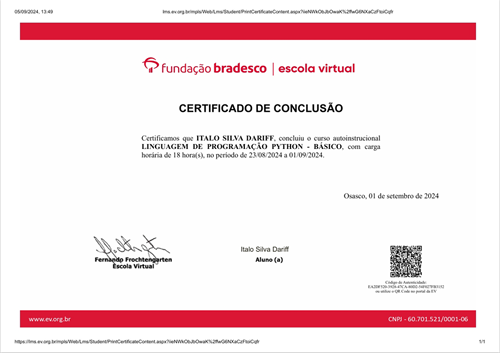
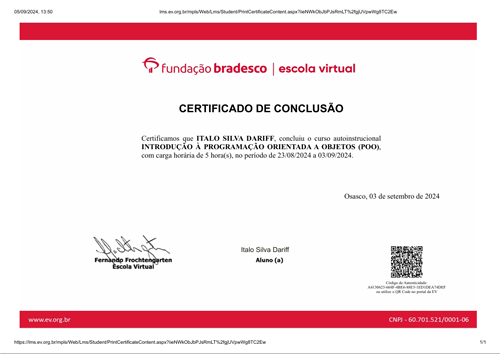
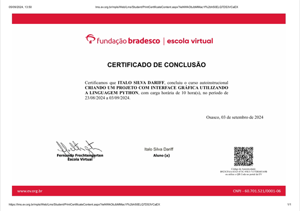

# Python_BradescoFoundation

Meu trabalho concluído para o curso de programação Python da Fundação Bradesco.

### Indices

  * Linguagem de Programação Python - Básica
  * Introdução a Programação Orientada a Objetos (OPP)
  * Desenvolvimento Orientado a Objetos com Python
  * Criando uma Interface Básica com Python

### Certificados

